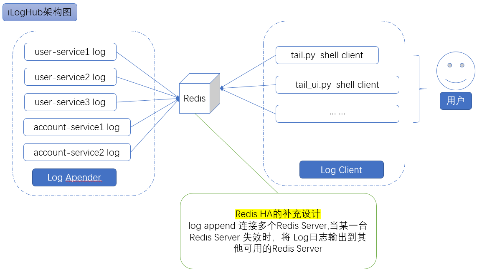

# iloghub
iloghub - immediate log hub. A solution for real-time log for java by logback extension

### 设计目标与约束

* 日志通过消息直接输出到redis。\[目标\]
* 日志客户端直接访问redis定义相应的实时日志。\[目标\]
* Redis 支持冗余配置。\[目标\]
* 支持高的网络流量。\[目标\]
* 完备的稳定性测试。\[目标\]
* Redis服务器不保留历史日志。\[约束\]

### 架构设计

